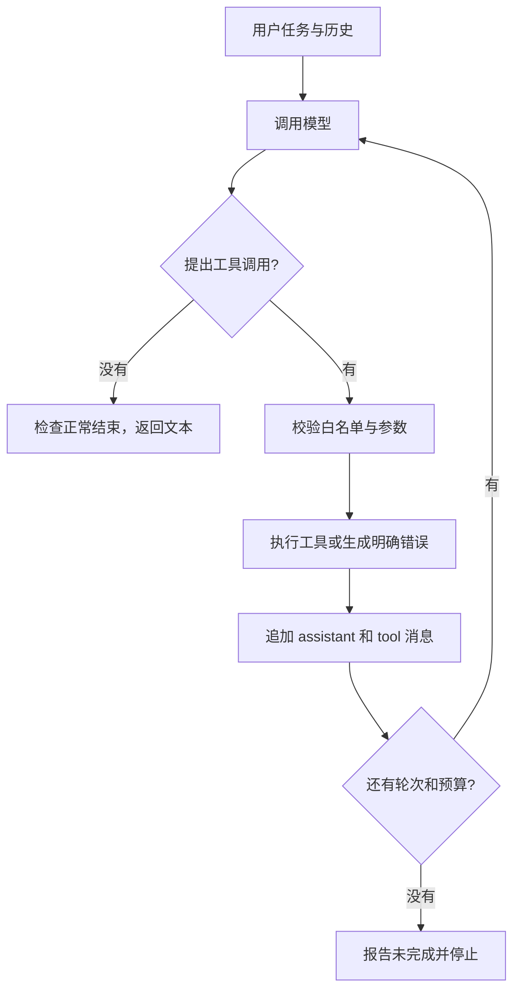

# 03：工具调用与手写 Agent 循环

## 先建立一个准确的理解

在本课程中，可以把最小 Agent 理解成：**模型根据当前状态提出行动，程序执行获准的行动，再把结果交给模型，直到完成或达到限制。** 模型、工具、状态、控制循环共同构成这个系统。

“请分步骤思考”是一种提示方式，不会自动赋予读文件、查询数据库或调用函数的能力。模型可以生成行动描述，真正的执行者是 Python。

## 我们为什么先用乘法工具

示例任务：每盒 17 支笔，23 盒是多少支？工具用确定性的本地乘法，没有天气接口、密钥、数据库等额外变量，也没有外部写入。你可以很容易地检查执行结果是否为 391。

即使模型自己也会算，这个实验仍有价值：目标是看见完整协议。提示词要求涉及乘法使用工具，但是否遵守仍应通过 trace 验证。

```bash
uv run python -m demos.beginner.beginner_03_agent_loop
```

阅读顺序：`toolbox.py` 的 `TOOLS` → `dispatch()` → `demos/beginner/beginner_03_agent_loop.py` 的 `run_agent()`。暂时不需要钻进观测实现。

## 第一步：描述工具，不是执行工具

`TOOLS` 告诉模型 `multiply` 的含义、参数名和类型。它只是一份 JSON Schema 描述。实际执行函数在白名单 `AVAILABLE_TOOLS` 中。

```python
AVAILABLE_TOOLS = {'multiply': multiply}
```

工具描述与执行实现要一致。把描述写成“加法”，实现却做乘法，会误导模型；让 schema 允许字符串，实现只接受数值，会增加错误。即使提供 schema，也必须在程序中校验实际参数。

## 第二步：模型返回一个调用请求

以下为示意响应片段：

```json
{
  "role": "assistant",
  "content": null,
  "tool_calls": [{
    "id": "call_example",
    "type": "function",
    "function": {"name": "multiply", "arguments": "{\"a\":17,\"b\":23}"}
  }]
}
```

`arguments` 是 **包含 JSON 的字符串**，要先 `json.loads()`，才得到 Python 字典。`content=null` 在工具调用中很正常，不能每次只读文本。协议及基本调用过程参见 [DeepSeek Tool Calls](https://api-docs.deepseek.com/guides/tool_calls/)。

## 第三步：程序决定能不能执行

`dispatch()` 做四件事：检查工具是否在白名单；解析参数；检查字段、类型和范围；调用已注册函数。它不会执行模型生成的 Python，更不会使用 `eval()` 或把字符串送进 shell。

本例只接受 `a`、`b` 两个有限数值，绝对值不超过一百万。不接受 bool，是因为 Python 的 bool 在某些数值检查里会被当成 int，需要显式排除。参数出错时返回稳定的 `{'ok': False, 'error': ...}`，让模型可以看到实际失败，而不是编一个结果。

业务调用通过 `model.execute_tool(call, dispatch)`，它只负责记录工具的输入、输出和耗时，不替你实现工具。

## 第四步：保存调用消息，再回填执行结果

```python
messages.append(message)
messages.append({
    'role': 'tool',
    'tool_call_id': call['id'],
    'content': json.dumps(result, ensure_ascii=False),
})
```

必须保留模型原来的 assistant 消息，之后的 tool 消息通过 ID 与它配对。只有工具结果、没有对应调用，或者 ID 对不上，都会破坏对话结构。模型一次可能要求多个工具，程序要逐个处理并逐个回填；本项目顺序执行，方便看清流程。

## 第五步：把新的历史再发给模型



`run_agent()` 中这个循环是普通 `for`。在每个节点你都能打印或检查状态。它有模型轮次上限 5、工具次数上限 8、累计 token 软预算 8000；这些用于教学防止无界循环，详细区别见第六节。

典型运行应看到 2 次模型调用、1 次工具执行、1 个根 span。复杂任务或模型反复请求时数量会增加，工具链不保证总是四条。

## 实验

1. 把问题改成 12 盒、每盒 8 支。检查实际参数是否改变，工具结果是否 96。
2. 改为“分别计算 17×23 和 12×8”。观察它是在一轮返回多个 tool call，还是分轮请求，不预设固定轨迹。
3. 在本地 Python 中调用 `dispatch()`，传入未知工具或错误 JSON，不需要调用模型。检查得到的是错误对象。
4. 将 `max_rounds` 改为 1。若第一轮产生工具调用，工具执行后没有第二次请求的额度，应明确报告未完成，不能伪装成最终成功。

## 自检

- 谁决定建议调用哪个工具？模型。谁决定是否真的允许？程序。
- 工具已经执行，为什么还要第二次模型调用？让模型根据实际结果组织答案或继续行动。
- 是否所有任务都应使用 Agent？不必。步骤固定且可确定实现的任务，普通函数或固定工作流往往更简单。

下一节：[结构化输出](04-json.md)。
