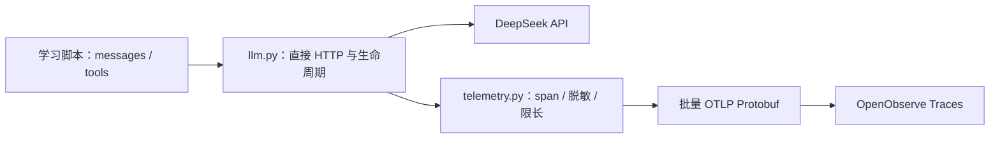

# OpenObserve：先看清每一步发生了什么

## 本机入口与第一条记录

界面是 [http://localhost:5080/web/](http://localhost:5080/web/)。组织为 `default`，默认 trace stream 为 `default`。登录信息只放在本机配置或凭据管理器，文档不保存真实用户名、密码或 Basic 编码。

```bash
cd /Users/wangying/apps/sakelei/ai/agent-learning
uv run python verify_observe.py
```

它生成一个 `observability.check` span，发送后按 `trace_id` 查回；只有查到才输出成功结果。这个实验不调用模型、不生成重复业务日志。服务器 HTTP 200 只是接收证据，能查回才是完整验证。

## trace 和 span 是什么

Trace 表示一次完整运行；span 表示其中一个步骤。每个 span 有自己的 `span_id`，同一次运行共享 `trace_id`。OTLP 中的 parent span ID 说明归属关系；本机 OpenObserve 的 SQL 字段是 `reference_parent_span_id`。

普通问答是 2 个 span。一次典型的计算 Agent 是 4 个：

```text
agent.run
├── chat deepseek-flash  # 第一次请求：模型提出 multiply
├── execute_tool         # Python 校验参数并得到 391
└── chat deepseek-flash  # 第二次请求：带上工具结果，得到最终回答
```

工具与模型调用都是运行根节点的子节点。用 `app.llm_call` 确认工具来自第几次模型请求；固定 RAG 的前置检索取值为 0，表示尚未调用模型，用 `gen_ai.tool.call.id` 对照消息里的 `tool_call_id`。trace ID 是关联观测的，tool call ID 是关联协议消息的，两者用途不同。

## 低噪音规则

| 记录 | 数量与内容 |
|---|---|
| 运行根 span | 每次示例一次；记录课程标识、模型/工具调用次数、已知累计 token |
| 模型 span | 每次实际请求一次；请求、响应、HTTP 状态、结束原因、耗时、用量 |
| 工具 span | 每次分发一次；工具名、参数、结果及错误 |
| 流式响应 | 完整 SSE 行与重组 JSON 同时保存在同一个模型 span，终端仍然逐段显示；不为每个 chunk 建 span |
| HTTP 库、DNS、连接池、心跳 | 不自动埋点、不产生 span |
| 上报请求本身 | 不埋点，避免上报产生更多上报 |
| 日志与指标 | 初期不重复发送同一份请求/响应到 Logs，也不单独发送 metrics |

所有真实模型示例经由 `llm.py`。故障注入与默认离线评估使用同一客户端、假 HTTP 和内存 exporter，不读取本机密钥、不连接模型或 OpenObserve；恢复 demo 不调用模型。新实验也使用 `DeepSeekClient`，直接绕过它调用 `httpx` 不会自动被捕获。`with` 的退出逻辑负责结束运行并刷出记录，包括发生异常时。业务脚本不用接触 OpenTelemetry。

## 在 UI 里看什么

在 `agent-learning/` 目录运行 `uv run python -m demos.beginner.beginner_01_chat`，复制终端的 `trace_id`。在 Traces 里选择 stream 和时间范围，按该 ID 搜索并点选 `chat deepseek-flash` span。

「预览」现在把完整请求/响应 JSON 放在单条文本消息里，不再拆成 system/user 角色气泡。要复制、查询权威请求体，仍可切到模型 span 的「属性」页，展开或搜索 `app.request`；这里保存发送给 DeepSeek 的完整 JSON body，包括 `model`、完整 `messages`、`thinking`、`max_tokens`、`stream` 及本次调用使用的 `tools`、响应格式等参数。`app.response` 保存提供方返回的完整响应 JSON。两者都作为单个 JSON 字符串存储，不会在采集前抽取或压缩消息字段。

正文采集需保持 `TELEMETRY_CAPTURE_CONTENT=true`。为防止凭据泄漏，属性值仍会脱敏，且受 `TELEMETRY_CONTENT_MAX_CHARS` 上限约束；如果 `.truncated` 为 `true`，调高该值后重新运行示例。HTTP Authorization header 不属于请求 body，也不会写入 trace。

| 属性名 | 含义 |
|---|---|
| `gen_ai.input.messages` / `gen_ai.output.messages` | OpenObserve「预览」的显示字段，分别以单条文本承载完整请求 JSON 和完整响应 JSON；实际请求/响应正文以 `app.request` / `app.response` 为准 |
| `app.request` | 实际发送的完整 JSON body 的脱敏、限长副本；原始结构可在「属性」页查看 |
| `app.response` | 提供方完整响应 JSON 的脱敏、限长副本；流式调用为重组后的响应，不是逐个网络包 |
| `app.response.sse` | 流式调用收到的完整 SSE 行记录（含 data、保活/注释行与 `[DONE]`；换行统一为 `\n`），不为每个 chunk 单独建 span |
| `http.request.method` / `url.full` / `server.address` | 实际 HTTP 方法、完整 endpoint 与主机名 |
| `http.request.body.size` / `http.response.body.size` | 实际发送/接收的 body 字节数；字符数另见 `.chars` |
| `http.response.header.*` | 安全白名单中的响应头：content type、provider request ID、限流和 retry-after；Authorization 不记录 |
| `app.request.truncated` / `app.response.truncated` | 是否超出正文长度上限 |
| `app.request.chars` / `app.response.chars` | 脱敏后、截断前的字符数 |
| `gen_ai.request.model` / `gen_ai.response.model` | 请求模型名与实际返回模型名 |
| `gen_ai.usage.input_tokens` / `gen_ai.usage.output_tokens` | 服务端报告的输入、输出 token |
| `gen_ai.response.finish_reasons` | 模型本次停止原因 |
| `app.elapsed_ms` | 该步骤的客户端耗时（毫秒） |
| `http.response.status_code` | 已收到 HTTP 响应时的状态码 |
| `error.type` / span 状态 | 异常类型和 ERROR 状态 |
| `app.stream.complete` | 是否读到流式结束标志 |
| `app.tool.request` / `app.tool.response` | 工具调用请求及实际结果 |

预览用的 `gen_ai.input.messages` / `gen_ai.output.messages` 把完整 JSON 文本包装成单条消息，让 OpenObserve 原样展示请求和响应；`app.request` / `app.response` 是可复制、可查询的权威正文。内容仍受同一采集开关、递归脱敏和长度上限控制，不另发 events。OpenObserve 通常把属性名中的点转为下划线用于 SQL，例如 `gen_ai.input.messages` 显示为 `gen_ai_input_messages`。

可直接验证具体运行（查询最近 24 小时，最多返回 100 个 span）：

```bash
uv run python verify_observe.py --trace-id 实际trace_id --expect 4
```

默认 `--expect 1` 只证明至少有记录；普通问答传 2，典型单工具 Agent 传 4。该查询不会生成新的模型请求或 trace。

## 接入如何封装



本项目使用 OpenTelemetry 的 trace SDK 和批量处理器，100% 采样。导出器向 `http://localhost:5080/api/default/v1/traces` 发送标准 OTLP Protobuf。Basic 鉴权只放 HTTP header，不存进 span。协议与端点参见 [OpenObserve 官方说明](https://openobserve.ai/docs/ingestion/traces/opentelemetry/)。

为了使行为容易观察，导出器每批只发送一次，网络超时为 3 秒；收到部分拒收也按失败处理。上报失败只在本次 exporter 首次失败时提示一行，不覆盖模型结果。退出时会刷出内存队列。模型请求也不自动重试，因此每一条模型 span 对应一次实际请求。

这是本地教学底座，不是持久化消息队列：断网、进程被强杀、队列溢出或服务拒收都可能丢记录。当前队列上限 256 个 span，每批最多 32 个。`failed_spans` 是未确认整批成功的数量，不是服务器精确丢失计数。部署时再考虑 Collector、持久化缓冲和告警。不要用“把成功率采样调低”的方式隐藏学习过程。

## 正文、脱敏与长度

学习默认记录 messages、工具定义、参数、返回值、响应和服务端提供的 `reasoning_content`（若有）。不采集 header、环境变量、异常堆栈。已知模型密钥、配置的鉴权值、常见敏感字段以及 JSON 字符串中的敏感字段会替换为 `[REDACTED]`。

正文每份默认最多 32768 字符，截断有显式标记。模型实际收到的请求不受观测脱敏或截断影响。用于学习的大部分短请求能完整看到；大型输入需要调高 `TELEMETRY_CONTENT_MAX_CHARS` 后重新运行。截断后的属性可能不是完整 JSON，不能直接作为 API 请求重放。

自动脱敏不是通用隐私识别。初期用虚构材料；处理真实敏感文本时设置 `TELEMETRY_CAPTURE_CONTENT=false`，保留用量、耗时、状态等信息。脱敏不负责更改业务数据或终端输出。

## 常见问题

| 现象 | 先检查 |
|---|---|
| 连接被拒绝 | OpenObserve 容器是否启动、本机 5080 端口是否可用 |
| HTTP 401 / 403 | Basic 凭据、组织权限；Base64 编码也是凭据，不是加密 |
| HTTP 404 | trace 地址应以 `/api/default/v1/traces` 结尾；变量里不要重复拼接 |
| 模型成功但没有 trace | 看终端一次性提示，再运行验证脚本；检查时间范围、stream、服务名 |
| 找不到 `agent-learning` 服务 | 本机原有 `.env` 的 `OTEL_SERVICE_NAME=chat-demo` 优先 |
| 有 token 没有正文 | `TELEMETRY_CAPTURE_CONTENT` 是否关闭；是否发生了收到响应前的网络错误 |
| Logs 页面为空 | 当前只写 Traces，属于预期行为 |
| 终端已显示半句但调用报错 | 流可能提前中断，检查 `app.stream.complete` 和 span 状态 |

本项目的模型与上报 HTTP 客户端都设置 `trust_env=False`，不继承 shell 的代理。需要代理才能连接 DeepSeek 的环境，可在 `llm.py` 的 HTTP 客户端中明确配置；不要让本机上报请求误走远端代理。

原有 OpenObserve 位于 `~/docker-stack/openobserve` 时，可以在该目录运行 `docker compose ps` 查看状态、`docker compose up -d` 启动现有服务、`docker compose logs --tail=50` 排查。无需重新部署或清除已有数据。
